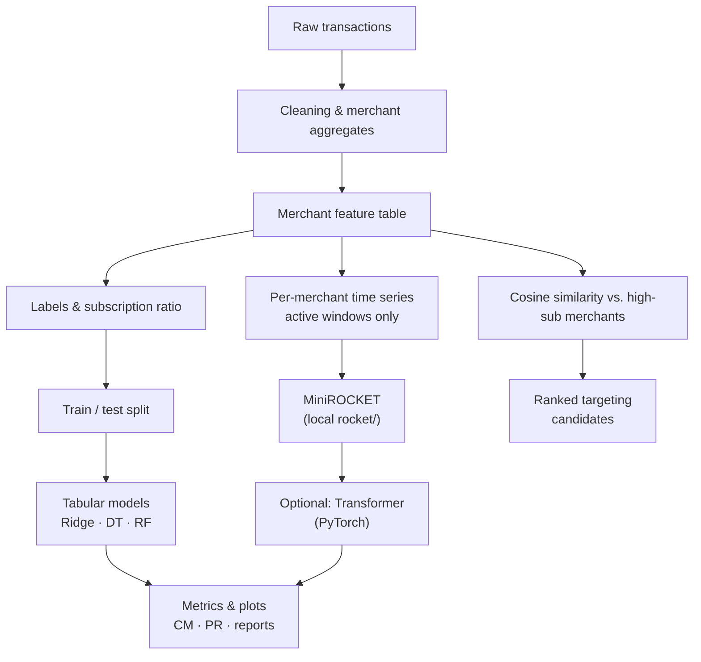

# STRIP

Thesis codebase for **merchant subscription analysis**: transaction data is cleaned and aggregated, **merchant-level features** are built, and **subscription vs. non-subscription** behaviour is studied with tabular models, **cosine-similarity**–based candidate discovery, **MiniROCKET** time-series features (local `rocket/` package), and an optional **PyTorch transformer** classifier. Outputs include confusion matrices, precision–recall curves, and ranked targeting scores.

## Repository layout

| Path | Role |
|------|------|
| `Stipe_final.ipynb` | End-to-end notebook (main entry point) |
| `analysis.ipynb`, `analysis copy.ipynb` | Additional exploratory analyses |
| `rocket/` | MiniROCKET / related transforms (requires **Numba**) |
| `requirements.txt` | Python dependencies |

## Setup

```bash
python -m venv .venv
source .venv/bin/activate   # Windows: .venv\Scripts\activate
pip install -r requirements.txt
```

For GPU **PyTorch**, follow the install command from [pytorch.org](https://pytorch.org) for your platform, then install the rest from `requirements.txt` if needed.

## Pipeline overview



Data paths and credentials are not committed; configure them inside your notebooks or environment as you already do locally.
