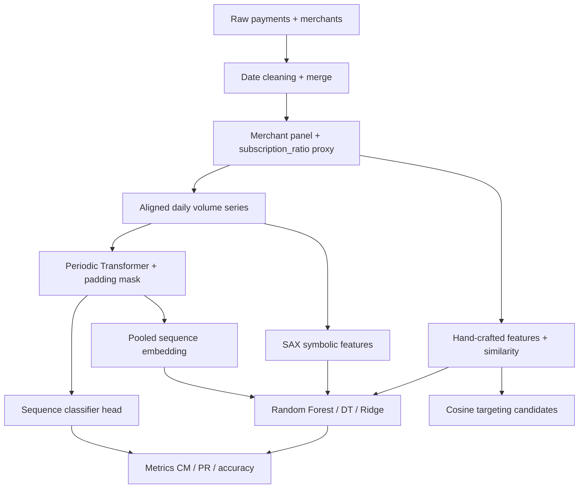

# STRIP — merchant subscription / recurrence analysis

Thesis codebase for **merchant-level subscription behaviour** from Stripe-style payment panels: raw payments are cleaned and merged with merchant metadata, **pseudo-labels** are derived from payment-type mix, **hand-crafted recurrence features**, optional **SAX** bag-of-symbols features, and a **periodic positional Transformer** on aligned daily series (pooled embeddings can be concatenated with tabular features for a second-stage **Random Forest**). Outputs include confusion matrices, precision–recall curves, cosine-similarity candidate lists, and business-facing conversion estimates.

---

## 1. Problem

We study **which merchants behave like subscription businesses** when we only observe aggregated payment activity (daily volumes, checkout vs. payment-link vs. subscription-tagged volume, industry, size).

Goals in this repository:

- **Binary classification**: separate merchants with a **high** share of subscription-tagged volume from those with a **low** share, using features derived from payment timing and amounts.
- **Targeting / discovery**: rank **low–subscription-ratio** merchants that look **similar** (in feature space) to known high-subscription merchants, as candidates for product or go-to-market outreach.

The core difficulty is that **subscription-ness is not a direct class label**: it must be inferred from **noisy, aggregated proxies** tied to how volume is routed through Stripe products (checkout, Payment Links, subscription billing).

---

## 2. Preprocessing

End-to-end steps (see `Stipe_final.ipynb`):

1. **Load** merchant and payment tables from `dataset/dstakehome_merchants.xlsx` and `dataset/dstakehome_payments.xlsx`.
2. **Normalize keys**: cast `merchant` identifiers to string on both sides.
3. **Date unification** (`unify_test_dates`): map heterogeneous date strings (ISO with `Z`, `YYYY-MM-DD`, `dd-Mon-yy`, etc.) to parsed datetimes; invalid values become `NaT`. The same helper is applied to payment `date` and merchant `first_charge_date`.
4. **Merge**: `payments_df_clean` left-join **merchants** on `merchant`; drop `first_charge_date` and `country` from the wide table; **remove** sentinel merchant `'0'`.
5. **Merchant-level aggregates**: compute **subscription ratio**  
   \(\text{subscription\_ratio} = \sum \text{subscription\_volume} / \sum \text{total\_volume}\)  
   and basic **coefficient-of-variation** stats on total volume; merge these back onto the panel for filtering and analysis.
6. **Feature extraction loop**: group by `merchant` and pass each group to `merchant_recurring_features` (daily resampling, gaps, autocorrelations, etc.; see below).
7. **Missing values**: numeric feature matrix is filled (e.g. `fillna(0)`) before similarity and sklearn models.

For the **Transformer** (and related sequence experiments such as SAX), per-merchant **daily total volume** is materialized on a **common calendar grid** between global `min_date` and `max_date` so aligned series share one timeline.

---

## 3. Proxy mechanism (problem definition)

We treat this as a **novel weak-supervision scenario**:

- There is **no** curated human label for “runs a subscription program.”
- Instead, **subscription_ratio** (share of volume attributed to subscription flows) acts as a **continuous proxy** for underlying business model.
- **Pseudo-labels** for supervised models are created by **thresholding** that proxy, for example:
  - **Positive**: merchants with `subscription_ratio` above a high cutoff (e.g. **> 0.7** in training splits).
  - **Negative**: merchants with `subscription_ratio` below a low cutoff (e.g. **< 0.2**).

This is explicitly **proxy-based supervision**: the model learns patterns correlated with **payment-rail semantics**, not a definitive ontology of “subscription business.” Analysis and deployment should treat errors as **proxy noise** (mis-tagged volume, hybrid models, seasonality) rather than only classifier noise.

Cosine similarity to the **mean feature vector of high-proxy merchants** (`sim_to_sub`, `similarity_to_good`) turns the same representation into a **ranking score** for low-proxy merchants who **look like** high-proxy peers.

---

## 4. Hand-crafted features

`merchant_recurring_features` builds **one row per merchant** from the daily series of `total_volume` (zeros on inactive days after `asfreq('D')`). Examples:

| Category | Features (illustrative) |
|----------|-------------------------|
| **Activity** | `active_ratio` (share of days with positive volume) |
| **Recurrence / seasonality** | `weekly_autocorr`, `biweekly_autocorr`, `monthly_autocorr` |
| **Payment cadence** | `avg_gap_between_payments`, `gaps_std`, `gap_regularity_share_7d`, `gap_regularity_share_30d` |
| **Variability** | `cv_volume`, `cv_weekly`, `cv_monthly`, `burstiness` |
| **Calendar shape** | `weekday_entropy` |
| **Product mix (raw proxy channels)** | `subscription_ratio`, `checkout_ratio`, `payment_link_ratio` |
| **Metadata priors** | `industry_boost` (rule-based score from industry string), `volume_scale`, `total_volume` |
| **Targeting auxiliary** | `similarity_to_good` (cosine distance to centroid of very high `subscription_ratio` merchants) |

Tree models in the notebook often emphasize **monthly autocorrelation**, **industry boost**, and **monthly CV**, which matches the intuition that **stable, periodic** volume and **sector** carry signal beyond the raw proxy.

---

## 5. Periodic positional encoding, Transformer, and variable-length series

### Periodic positional encoding

Standard learned positions do not encode **billing-period structure**. The notebook’s `PeriodicPositionalEncoding` adds a **fixed** multi-period sinusoidal map over time indices, with periods aligned to **7, 14, 30, 90** days (week, biweek, month, quarter), plus a **normalized linear index**, then a **linear projection** to `d_model`. That gives the self-attention stack explicit **harmonic cues** for weekly and monthly structure.

### Transformer stack (conceptual)

- **Front end**: `MultiScaleTemporalConv` applies 1D convolutions with kernels **7 / 14 / 30** on the raw scalar series so local **multi-scale periodic** structure is available before attention.
- **Attention**: custom encoder-style layers inject **relative position bias** (bucketed by lag) so the model can learn **distance-dependent** coupling between days (e.g. month-apart peaks), with **padding masked** so padded positions do not contribute.

### How variable length is handled

| Approach | Mechanism |
|----------|-----------|
| **Hand-crafted features** | Variable-length history is **summarized** into scalars (autocorr, gaps, CV, etc.); no sequence model. |
| **Aligned daily series** | A **fixed** `min_date`–`max_date` grid gives every merchant the same length **before** the Transformer; this is the primary path in the current pipeline (not MiniROCKET). |
| **Transformer (`MerchantDataset`)** | When sequences still differ, each is **right-padded with zeros** to `max_len`; a **boolean padding mask** marks padded positions for attention. |
| **SAX pipeline (optional in notebook)** | **PAA + symbolization + bag-of-symbols** yields a **fixed-size** vector for any raw length (with interpolation when the series is shorter than the number of PAA segments). |

---

## 6. Methods compared (`Stipe_final.ipynb`)

The table summarizes **test accuracy** (percent, rounded) for the main modelling paths in `Stipe_final.ipynb`: pseudo-labeled merchants, held-out test split, and **Random Forest** where features are tabular (hand-crafted and/or SAX and/or Transformer **pooled embeddings**). The **periodic Transformer** row is **end-to-end** sequence classification on the aligned daily series. Figures can move slightly if you re-run cells (random splits, training noise).

| Method | Test accuracy (≈) | Notes |
|--------|------------------:|--------|
| **Hand-crafted + Random Forest** | **79%** | Scalar recurrence / mix features only (same RF family as in the notebook). |
| **SAX only + Random Forest** | **50%** | Symbolic aggregate approximation → fixed BoW vector; weak alone on this task. |
| **Periodic Transformer (sequence classifier)** | **82%** | `PeriodicMerchantTransformer`: multi-scale conv + periodic PE + relative position bias + padding mask. |
| **Hand-crafted + Transformer embedding + RF** | **83.3%** | Pooled sequence embedding concatenated with hand-crafted columns, then **Random Forest** on the fused matrix (best tabular stack in your runs). |

The notebook also trains **Ridge** and **Decision tree** baselines on hand-crafted features and reports **precision–recall AUC** for Random Forest on the subscription-positive class (useful for ranking despite headline accuracy).

**At a glance:** SAX alone is near chance for this label noise, the **Transformer** captures temporal structure (~82%), and **fusing** hand-crafted columns with Transformer embeddings pushes accuracy highest (~83%).

---

## Repository layout

| Path | Role |
|------|------|
| `Stipe_final.ipynb` | End-to-end notebook (main entry point) |
| `analysis.ipynb`, `analysis copy.ipynb` | Additional exploratory analyses |
| `subscription_candidates.ipynb` | Candidate scoring heuristics (gap / price / industry components) |
| `rocket/` | Optional MiniROCKET code (not used in the main `Stipe_final.ipynb` pipeline; requires **Numba** if you experiment) |
| `requirements.txt` | Python dependencies |

---

## Setup

```bash
python -m venv .venv
source .venv/bin/activate   # Windows: .venv\Scripts\activate
pip install -r requirements.txt
```

For GPU **PyTorch**, follow the install command from [pytorch.org](https://pytorch.org) for your platform, then install the rest from `requirements.txt` if needed.

---

## Pipeline overview



Data paths and credentials are not committed; configure paths inside your notebooks or environment as you do locally.
